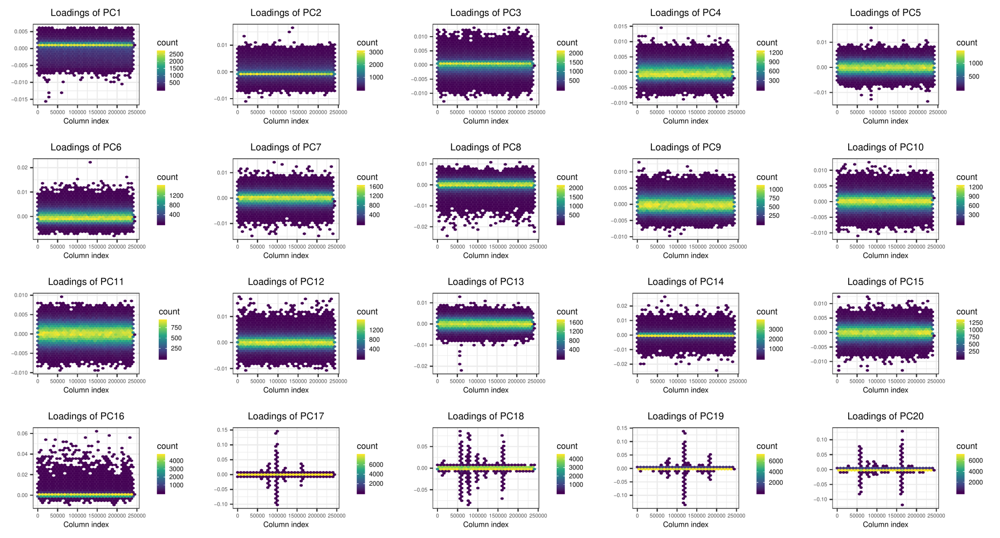
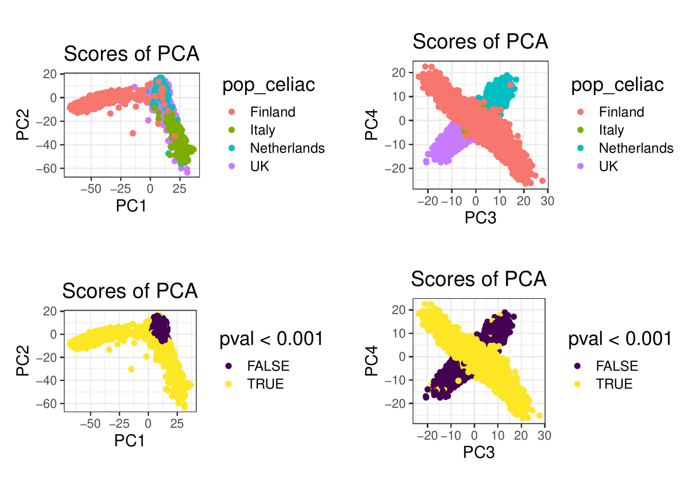
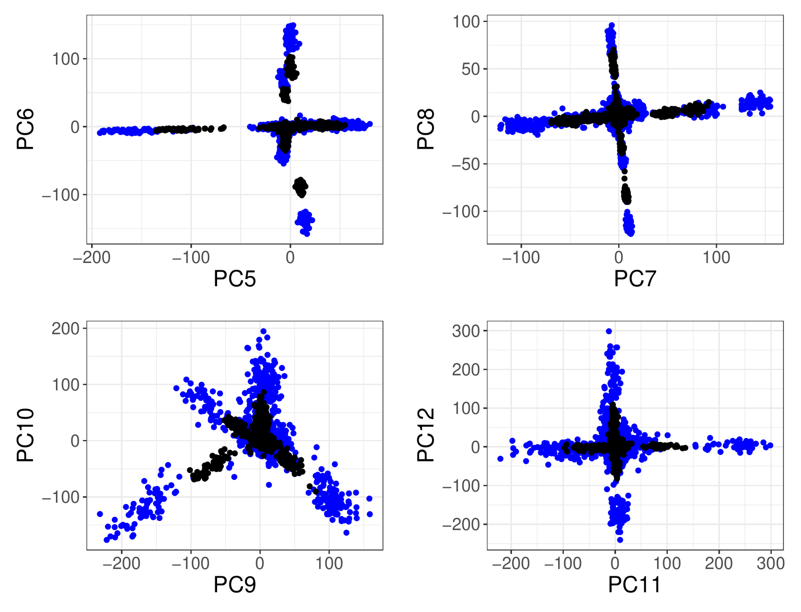

```{r setup, include=FALSE}
knitr::opts_chunk$set(fig.align = 'center', dev = "svg", out.width = "80%",
                      echo = FALSE)
options(width = 80)
```

class: title-slide center middle inverse

<br>

# Efficient toolkit <br> implementing best practices <br> for principal component analysis <br> of population genetic data

<br>

## Florian Privé

<br>

<br>

**Slides:** `https://privefl.github.io/paper4-bedpca/pca-toolkit.html`

---

## Motivation

<br>

Perform PCA analyses in iPSYCH appropriately and quickly.

<br>

--

<br>


## Disclaimer

<br>

Still unfinished work.

---

## Range of analyses

<br>

- Compute PCA on PLINK .bed files (with missing values)

- Perform pruning to reduce effect of Linkage Disequilibrium (LD)

- Further removing of long-range LD regions

- Detection of outlier samples?

- Detection of homogeneous samples -> Danes

- Projection of new individuals onto reference PCA space

- Ancestry matching

---

## Pruning and PCA

<br>

Using 20 physical cores,

- takes 22 minutes to perform a first phase of clumping on 406,545 unrelated individuals genotyped over 504,139 variants, which reduces the number of variants to 261,307. 

- then takes 34 minutes to compute the first 20 PCs using these 261,307 variants.

--

<br>

Method:

- Directly memory-map the bed file (access it as if it were a matrix in memory)

- Same PCA algorithm based on random projections, already used in PCA of R package bigstatsr (Privé et al. 2018) and in FlashPCA2 (Abraham et al. 2017).

---

## Problem of LD: PC reported by UK Biobank

```{r, out.width="98%"}
knitr::include_graphics("figures/UKBB-loadings1-40.svg")
```

---

## Problem of LD: PC computed after LD removal

Method: Robust Mahalanobis distance on PC loadings + Gaussian Smoothing = removing long-range LD outliers.

```{r, out.width="98%"}

```

---

## Remaining structure: 16 PCs

```{r, out.width="85%"}

```

---

## Detection of outlier samples in 1000G

Method: compare density around point with density around its K-Nearest Neighbours.

```{r}

```

---

## Restricting to homogeneous individuals

Method: Robust Mahalanobis distance on PC scores (approx. $\chi^2(K)$).

```{r, out.width="85%"}

```

---

## Projection of new individuals into reference PCA space

**Issue:** shrinkage bias when projecting new individuals (when p > n).

PCA on 60% of 1000G (**black**) / Projecting on remaining 40% (**red**):

```{r, out.width="95%"}
knitr::include_graphics("figures/proj1000G-PC1-8.svg")
```

Shrinkage factors: `1.01 1.02 1.07 1.09 1.51 1.68 1.94 1.40 2.88 3.17 2.90 2.92 3.23  5.13 5.25 5.04 4.58 5.69 6.26 6.32`.

---

## Projection of new individuals into reference PCA space

**Solution:** Online Augmentation, Decomposition, and Procrustes (OADP) projection (Zhang et al. 2019). We provide faster implementation.

PCA on 60% of 1000G (**black**) / OADP projection on remaining 40% (**blue**):

```{r, out.width="95%"}
knitr::include_graphics("figures/proj1000G-PC1-8.svg")
```

---

## Projection of new individuals into reference PCA space

**Limitation:** Projection on related individuals does not work.

PCA on 60% of 1000G (**black**) / OADP projection on same 60% (**blue**):

```{r, out.width="75%"}

```

---

## Ancestry matching

Method: Robust Mahalanobis distances by reference population.

```{r}

```


---

class: inverse, center, middle

# Thanks!

<br>

<br>

`r icon::fa("twitter")` [privefl](https://twitter.com/privefl) &nbsp;&nbsp;&nbsp;&nbsp; `r icon::fa("github")` [privefl](https://github.com/privefl) &nbsp;&nbsp;&nbsp;&nbsp; `r icon::fa("stack-overflow")` [F. Privé](https://stackoverflow.com/users/6103040/f-priv%c3%a9)

.footnote[Slides created via the R package [**xaringan**](https://github.com/yihui/xaringan).]
